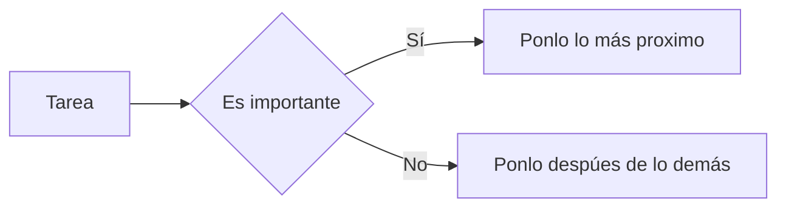

# Gestor de Tareas

Es un **Gestor**  que te gestiona gestionando las tareas que debes de gestionar para poder gestionar las tareas

Funcionando como un ***gestor que gestiona las tareas*** que introduzcas en un gestor de tareas que esta aqui

Funciona `eligiendo` una casilla según la importancía que tiene o que le das introduces la tarea

## Grafico

### API REST

